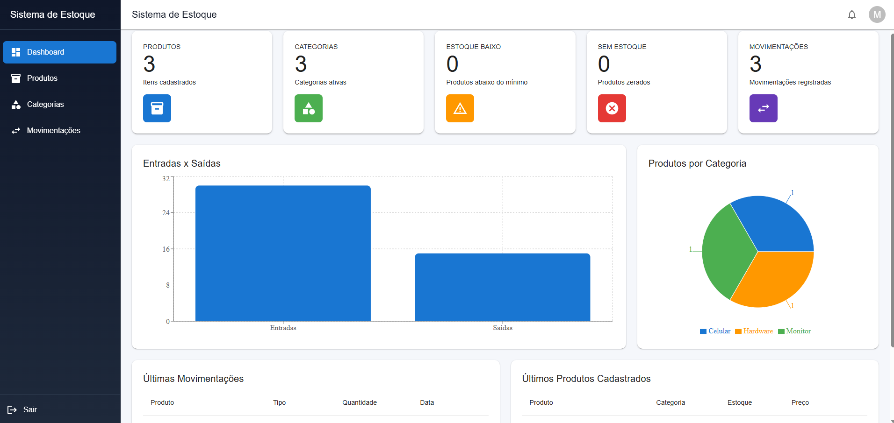
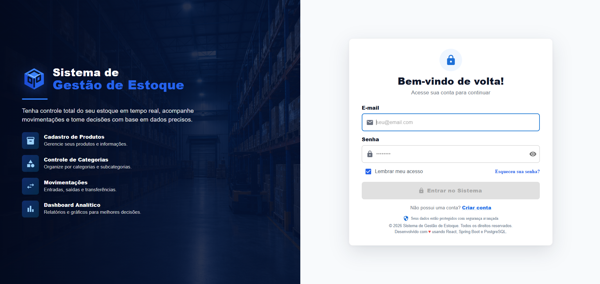
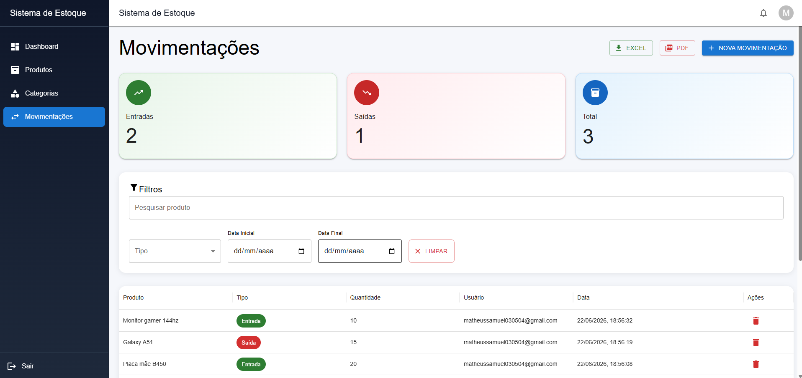
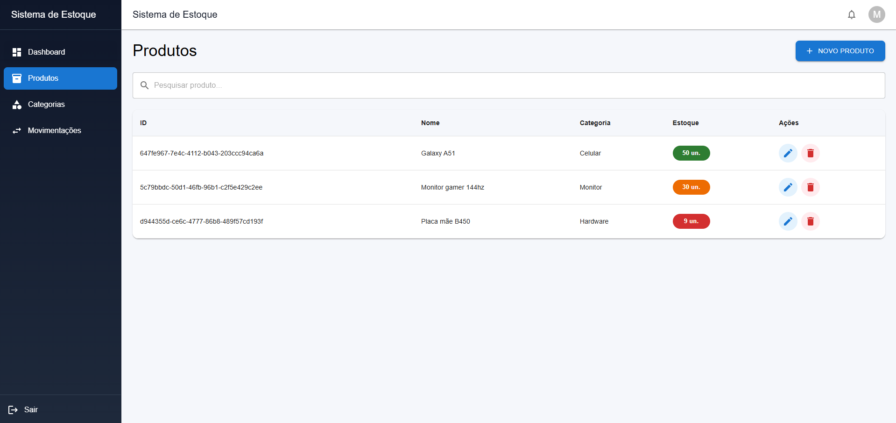

# 🚀 Sistema de Gestão de Estoque

<p align="center">
  <strong>Sistema Full Stack para controle de estoque, produtos, categorias e movimentações, desenvolvido com React, Spring Boot e PostgreSQL.</strong>
</p>

<p align="center">
  <a href="https://sistema-gestao-estoque-two.vercel.app">🌐 Demo Online</a>
  •
  <a href="https://github.com/matheus-samuel-dev/sistema-gestao-estoque">Frontend</a>
  •
  <a href="https://github.com/matheus-samuel-dev/sistema-gestao-estoque-api">Backend</a>
</p>

---

## 🏗 Arquitetura

```text
React + Vite
      ↓
Spring Boot REST API
      ↓
PostgreSQL
```

---

## ✨ Principais Funcionalidades

### 🔐 Autenticação

* Login e cadastro
* Recuperação de senha
* JWT Authentication
* Proteção de rotas

### 📦 Gestão de Produtos

* CRUD completo
* Controle de estoque
* Categorias
* Fornecedores
* Importação CSV/XLSX
* Anexos de documentos e imagens

### 📈 Movimentações

* Entradas
* Saídas
* Ajustes
* Transferências
* Devoluções
* Histórico completo

### 📊 Dashboard

* Indicadores em tempo real
* Produtos sem estoque
* Produtos com estoque baixo
* Entradas e saídas do mês
* Gráficos e relatórios

---

## 📸 Preview

### 📊 Dashboard

<p align="center">
  
</p>

### 🔍 Principais Telas

| 🔐 Login              | 📈 Movimentações              |
| --------------------- | ----------------------------- |
|  |  |

| 📦 Produtos              | 🏷 Categorias              |
| ------------------------ | -------------------------- |
|  |  |

---

## 🛠 Tecnologias

### Frontend

* React
* Vite
* Material UI
* React Router
* Axios
* Recharts
* jsPDF
* XLSX

### Backend

* Java
* Spring Boot
* Spring Security
* JWT
* Spring Data JPA
* PostgreSQL
* Resend API

---

## ⚙️ Executando Localmente

### Frontend

```bash
npm install
npm run dev
```

### Backend

```bash
./mvnw spring-boot:run
```

---

## 📚 Documentação

A documentação completa do produto está disponível em:

```text
/docs/PRODUCT_DOCUMENTATION.md
```

Incluindo:

* Casos de uso
* Estrutura do banco
* Fluxo JWT
* Endpoints
* Deploy
* Regras de negócio

---

## 🚀 Próximas Evoluções

* [ ] Tema claro/escuro
* [ ] Testes automatizados
* [ ] Notificações em tempo real
* [ ] Dashboard avançado
* [ ] Perfil de usuário
* [ ] Configurações personalizadas
* [ ] Melhorias de acessibilidade
* [ ] Experiência mobile aprimorada

---

## 👨‍💻 Autor

### Matheus Samuel

Desenvolvedor focado em Java, Spring Boot e desenvolvimento Full Stack.

🔗 Portfólio: https://matheus-samuel-dev.github.io/Portfolio/

🔗 LinkedIn: https://linkedin.com/in/matheus-samuel-dev

---

⭐ Se gostou do projeto, considere deixar uma estrela no repositório.
